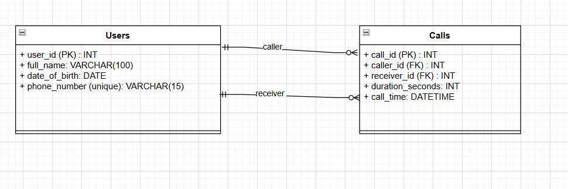

## 1. Vẽ ERD 

- Từ cơ sở dữ liệu có khả năng : 
    - Lưu thông tin của người dùng bao gồm (tên, ngày sinh, số điện thoại)
    - Lưu thông tin của cuộc gọi (sđt thực hiện cuộc gọi, sđt được gọi, thời lượng cuộc gọi, thời điểm thực hiện cuộc gọi)





## 2.  Viết câu lệnh truy vấn ra top 3 user có tổng thời lượng cuộc gọi lớn nhất trong tháng vừa rồi


```sql 

SELECT
    u.user_id,
    u.full_name,
    u.phone_number,
    SUM(c.duration_seconds) AS total_duration
FROM users u
JOIN Calls c ON u.user_id = c.caller_id 
WHERE DATE_FORMAT(c.call_time, '%Y-%m') = DATE_FORMAT(DATE_SUB(NOW(), INTERVAL 1 MONTH), '%Y-%m')
GROUP BY u.user_id, u.full_name, u.phone_number
ORDER BY total_duration DESC
LIMIT 3;

```

## 3. VIết câu lệnh truy vấn ra những user có tổng thời lượng cuộc gọi lớn thứ 2. (Lưu ý có thể có trường hợp 2 hoặc nhiều user có tổng thời lượng cuộc gọi bằng nhau)


```sql

WITH user_totals AS (
    SELECT
        u.user_id,
        u.full_name,
        u.phone_number,
        SUM(c.duration_seconds) AS total_duration
    FROM Users u
    JOIN Calls c ON u.user_id = c.caller_id
    GROUP BY u.user_id, u.full_name, u.phone_number
),
ranked AS (
    SELECT
        *,
        DENSE_RANK() OVER (ORDER BY total_duration DESC) AS rnk
    FROM user_totals
)
SELECT user_id, full_name, phone_number, total_duration
FROM ranked
WHERE rnk = 2;

```

